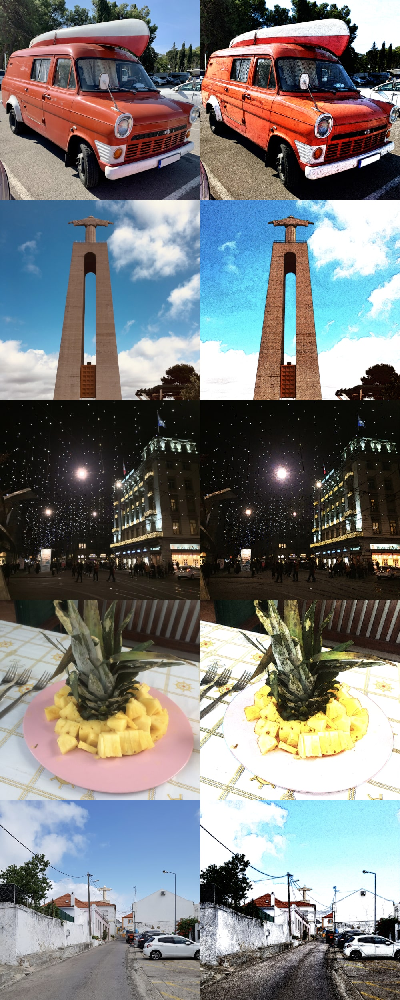

# python-fu-cartoonify
A set of GIMP plug-ins to turn a photo into a cartoon.

## Preview

# Installation
1. Copy `python_fu_cartoonify.py` into the plug-in folder listed under `Edit > Preferences > Folders > Plug-ins`.
1. On unix ensure the file can be executed as program.
1. Restart GIMP, the plug-ins are listed under `Filters > Artistic > Cartoonify`

# License
python-fu-cartoonify is licensed under the [GPL-3.0 License](https://raw.githubusercontent.com/pascalre/python-fu-cartoonify/master/LICENSE).